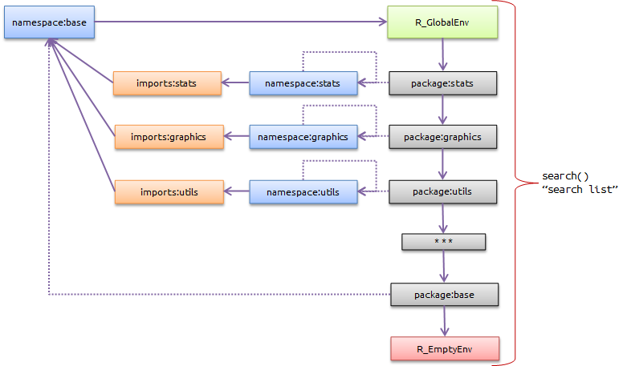

```{r setup, include=FALSE}
knitr::opts_chunk$set(echo = TRUE, tidy=TRUE, tidy.opts=list(blank=FALSE, width.cutoff=50))
options(width=50)
# Install necessary packages only
InstallPackages <- function(Packages) {
  sapply(Packages, function(Package) 
    if (!Package %in% installed.packages()[, 1]) install.packages(Package))
}
InstallPackages(c("pryr", "methods", "R6", "microbenchmark", "rversions"))
```

# Architecture

## R-core

Fonctions primitives et structures de données de base.

Exemples : fonction `sum` et données de type `matrix`:

```{r Core, echo=TRUE}
pryr::otype(sum)
pryr::otype(matrix(1))
```

## S3

Langage orienté objet.

Classes déclaratives.

```{r S3-1, echo=TRUE}
MonPrenom <- "Eric"
class(MonPrenom) <- "Prenom"
```


## S3 - Méthodes

Les méthodes S3 sont liées aux fonctions, pas aux objets.
```{r S3-2, echo=TRUE}
# Affichage par défaut
MonPrenom
print.Prenom <- function(x) cat("Le prénom est", x) 
# Affichage modifié
MonPrenom
```


## S3 - Génériques

`print` est une méthode générique ("un générique") déclaré dans base.

```{r print-help, echo=TRUE, eval=FALSE}
help(print)
pryr::otype(print)
```

Son code se résume à une déclaration `UseMethod("print")`:
```{r print-code, echo=TRUE}
print
```

## S3 - print

Il existe beaucoup de méthodes S3 pour `print`:
```{r printS3, echo=TRUE}
head(methods("print"))
```

Chacune s'applique à une classe. `print.default` est utilisée en dernier ressort et s'appuie sur le type (R de base), pas la classe (S3).

```{r print.defaut, echo=TRUE}
typeof(MonPrenom)
pryr::otype(MonPrenom)
```

## S3 - Héritage

Un objet peut appartenir à plusieurs classes.

```{r S3-3, echo=TRUE}
class(MonPrenom) <- c("PrenomFrancais", "Prenom")
inherits(MonPrenom, what = "PrenomFrancais")
inherits(MonPrenom, what = "Prenom")
```

## S3 - Héritage

Le générique cherche une méthode pour chaque classe, dans l'ordre.

```{r S3-4, echo=TRUE}
print.PrenomFrancais <- function(x) cat("Prénom français:", x) 
MonPrenom
```

## S3 - Résumé

S3 est le langage courant de R.

Presque tous les packages sont écrits en S3.

Les génériques sont partout mais passent inaperçu:

```{r S3-5, echo=TRUE}
library("entropart")
.S3methods(class="SpeciesDistribution")
# help(InternalMethods)
```


## S4

S4 structure les classes :

- slots pour les données ;

- constructeur explicite.

```{r S4-Class}
setClass("Personne",  slots = list(Nom = "character", Prenom = "character"))
Moi <- new("Personne", Nom="Marcon", Prenom="Eric")
pryr::otype(Moi)
```


## S4 - Méthodes

Les méthodes appartiennent toujours aux fonctions:

```{r S4-print}
setMethod("print",
  signature="Personne",
  function(x, ...) {
    cat("La personne est:", x@Prenom, x@Nom) 
  }
)
print(Moi)
```


## S4 - Résumé

S4 est plus rigoureux que S3.

Quelques packages sur CRAN : Matrix, sp, odbc,... et beaucoup sur Bioconductor.


## RC

RC a été introduit dans R 2.12 (2010) avec le package _methods_.

Les méthodes appartiennent aux classes, comme en C++.

```{r RC-Class, tidy=FALSE}
library("methods")
PersonneRC <- setRefClass("PersonneRC", 
    fields = list(Nom = "character", Prenom = "character"),
    methods = list(print = function() cat(Prenom, Nom)))
MoiRC <- new("PersonneRC", Nom = "Marcon", Prenom ="Eric")
pryr::otype(Moi)
MoiRC$print()
```

## S6

[S6](https://cran.r-project.org/web/packages/R6/vignettes/Introduction.html) perfectionne RC mais n'est pas inclus dans R.

Les attributs et les méthodes peuvent être publics ou privés.

Une méthode `initialize()` est utilisée comme constructeur.


```{r S6-Class}
library(R6)
PersonneR6 <- R6Class("PersonneR6", 
                      public = list(Nom="character", Prenom="character",
                                    initialize = function(Nom=NA, Prenom=NA) {
                                      self$Nom <- Nom ; self$Prenom <- Prenom},
                                    print = function() cat(Prenom, Nom)))
MoiR6 <- PersonneR6$new(Nom = "Marcon", Prenom ="Eric")
MoiRC$print()
```

## RC et S6 - Résumé

Très peu utilisés, plutôt considérés comme des exercices de style.

S6 permet de programmer rigoureusement en objet.

Les performances sont inférieures à celles de S3.


# Style

## Choisir son style de code

Pas d'obligation mais cohérence à assurer.

Nommage des objets :

- _CamelCase_ : les mots sont compactés, les majuscules assurent la lisibilité ;

- _tiret_bas_ : les espaces sont remplacés par des _, pas de majuscule.

Les points sont interdits : séparateurs des génériques.
Hélas : `data.frame`, `t.test()`.

Utiliser des noms clairs, pas de `valeur=12` ou `TarbrInv`.


## Affectation

Utiliser impérativement `<-` et réserver `=` aux arguments de fonctions.

```{r, tidy=FALSE}
a <- b <- 12
a
b
(a <- runif(1)) * (rnorm(1) -> b)
```


## Espacement

Entourer `<-` par des espaces pour éviter la confusion avec `-`.

Respecter l'espacement standard du code autant que possible.
_knitr_ avec l'option `tidy=TRUE` met en forme automatiquement le code des documents RMarkdown.


## Alignement

Aller à la ligne entre les commandes, éviter `;`.

Les accolades commencent sur la ligne de la commande, se terminent sur une ligne seule.

Identer avec deux espaces. 
Tabulations interdites.

```{r}
if(a>b) {
  print("Plus grand")
} else {
  print("Plus petit")
}
```


## Commentaires

Dans le code, commenter toute ligne non évidente (de l'ordre de 2 sur 3).

Commenter le pourquoi, pas le comment sauf extraordinaire.

Le commentaire précède la ligne de code ou se place en fin de ligne.

```{r, eval=FALSE}
# Calcul de la surface
if(is.null(Largeur)) {
  # Longueur seulement: carré
  Longueur^2
} else {
  # Vrai rectangle. Formule de xxx(1920).
  Longueur*Largeur
}
```

Bien choisir la langue des commentaires. Accents interdits dans les packages.


## Commentaires

Commentaires de blocs par :

```{r}
# Première partie ####
x <- 1
# Deuxième partie ####
y <- 2
```

Ces blocs sont repliables dans RStudio (menu _Edit_ / _Folding_).


## Appel des fonctions

Les fonctions du package _base_ sont toujours disponibles. Les autres non.

Les packages chargés par défaut peuvent être déchargés: _utils_, _graphics_, _stats_

Bonne pratique :

- usage interactif : taper le nom de la fonction seulement : `fonction()`

- code à conserver : préciser le package (une fonction peut être masquée par un autre package) : `package::fonction()`.


## Appel des fonctions

Principes :

- `library("package")` charge `loadNamespace()` et attache `attachNamespace()` un package

- le package exporte des fonctions : `package::fonction()`

- les fonctions sont accessibles par leur nom `fonction()`

- si `nouveaupackage` exporte `nouveaupackage::fonction()`, la nouvelle fonction masque l'ancienne.


# Environnements et recherches


## Hiérarchie des environnements

```{r R-library, echo=FALSE, out.width='95%'}

```

[Référence](http://blog.obeautifulcode.com/R/How-R-Searches-And-Finds-Stuff/)


## Hiérarchie des environnements

R démarre dans l'environnement vide.

Chaque package chargé crée un environnement fils.

La console se trouve dans l'environnement global, fils du dernier package chargé.

```{r}
search()
```


## Environnements fils de _.GlobalEnv_

Le code d'une fonction appelée de la console s'excute dans un environnement fils de _.GlobalEnv_ 

```{r}
environment()
f <- function() environment()
f()
parent.env(f())
```


## Recherche d'un objet

La recherche part de l'environnement global (ou de celui d'une fonction appelée) et descend la colonne de droite.

```{r, echo=FALSE, out.width='70%'}

```

Les packages doivent être attachés pour y être.


## Packages chargés

Un package chargé est dans la colonne centrale: son espace de noms est accessible mais ses objets ne sont pas inclus dans la recherche.

```{r, echo=FALSE, out.width='70%'}

```


## Packages chargés non attachés 

devtools peut être chargé sans être attaché :

```{r}
loadNamespace("devtools")
search()
isNamespaceLoaded("devtools")
```

## Appel explicite d'un objet

La fonction `dr_devtools()` ne peut pas être trouvée mais elle peut être utilisée :

```{r}
tryCatch(dr_devtools,  error= function(e) print(e))
devtools::dr_devtools()
```


## Chargement implicite

`loadNamespace()` n'est jamais utilisé :

- Appeler `package::fonction()` charge le package,

- Attacher un package le charge.


## Objets non exportés

Les objets non exportés par un package sont accessible dans son espace de nom avec trois :

`package:::fonction()`

Les méthodes S3 ne sont normalement pas exportées, seul le générique l'est.

```{r}
names(formals(plot))
tryCatch(names(formals(entropart::plot.SpeciesDistribution)),  error= function(e) print(e))
names(formals(entropart:::plot.SpeciesDistribution))
```

## Packages importés

Les packages s'appuient sur d'autres packages.

Ils peuvent les importer : `ggplot2` importe plyr.

```{r, echo=FALSE, out.width='70%'}
knitr::include_graphics("Graphics/imports-depends-plyr.png")
```

ou en dépendre : `ggplot2` dépend de `reshape`.

Un package qui exporte une méthode S3 dépend forcément du package contenant le générique.


# Eléments du langage

## Type de données

Réel
```{r}
typeof(1.1)
```
Entier : forcer le type en précisant `L`
```{r}
typeof(1L)
```


## Type de données

Logique
```{r}
typeof(TRUE)
```

Complexe
```{r}
# help(complex)
typeof(sqrt(-1+0i))
```


## Type de données

Caractère
```{r}
typeof("Bonjour")
```

Brut
```{r}
# help(raw)
typeof(raw(1))
```


## Test du type de données

```{r}
is.character("Bonjour")
is.double(1.2)
is.logical(1>0)
```


## Test du type de données

Attention à `is.integer()` :

```{r}
is.integer(1)
typeof(1)
```

`is.atomic()` est vrai pour tous ces types.

`is.numeric()` est vrai pour les réels et les entiers.


## Structures de données

5 structures de données :

```{r, echo=FALSE}
df <- data.frame(Atomique=c("vector", "matrix", "array"), Recursif=c("list", "data.frame", ""))
rownames(df) <- c("Unidimensionnel", "Bidimensionnel", "n-dimensionnel")
colnames(df)[2] <- "Récursif"
knitr::kable(df)
```


## Vecteurs

```{r}
(MonVecteur <- 1:3)
```

Tous les éléments sont du même type :
```{r}
c(1, TRUE, "a")
```


## Matrices

```{r}
(MaMatrice <- matrix(1:6, nrow = 2))
```

La multiplication matricielle est très performante
```{r}
MaMatrice %*% matrix(1:3, ncol=1)
```


## Tableaux

```{r}
(MonTableau <- array(1:12, dim = c(2,3,2)))
```


## Listes

```{r}
(MaListe <- list(Premier=1:2, Deuxieme="a"))
identical(MaListe[[2]], MaListe$Deuxieme)
```


## Data frames


Les types de données sont uniques par colonne.

```{r, }
(Mondf <- data.frame(Article=c("Pommes", "Poires"), Prix=c(2,3)))
identical(Mondf[, 1], Mondf$Article)
```


## Fonctions

Elements fondamentaux du langage.

Toute opération repose sur des fonctions y compris `+` :
```{r, eval=TRUE}
(`+`)
```


## Fonctions internes et primitives

Les fonctions _primitives_ sont écrites en C : ce sont les plus rapides.

Les fonctions _internes_ aussi, mais doivent être appelées par un mécanisme spécial, moins efficace :
```{r}
cbind
```

[Référence](http://colinfay.me/r-internals/internal-vs-primitive.html)


## Fonctions standard : _closure_

La majorité des fonctions est écrite en R.

Leur type est _closure_ par opposition à _primitive_.

```{r}
apply
```


## Eléments d'une fonction

Arguments : passés à la fonction.
```{r}
args(apply)
```

Corps : le code de la fonction

```{r}
deparse(body(apply))[1:3]
```


## Eléments d'une fonction


Environnement : l'ensemble des objets déclarés et un pointeur vers l'environnement parent.
```{r}
environment(apply)
ls(environment(apply))[1:2]
parent.env(environment(apply))
```


## Environnement d'une fonction

Une fonction est exécutée dans son propre environnement :
```{r}
environment()
f <- function() environment()
f()
```

Son environnement parent est celui du code qui l'a appelé :
```{r}
parent.env(f())
```


## Corps d'une fonction

Code R standard.

```{r}
Surface <- function(Longueur, Largeur) {
  return(Longueur * Largeur)
}
Surface(Longueur = 2, Largeur = 3)
```

Retourne un résultat avec `return()` ou la dernière valeur calculée.


## Portée des variables

```{r}
Volume <- function(Longueur, Largeur) {
  return(Longueur * Largeur * Hauteur)
}
Longueur <- 5
Hauteur <- 10
Volume(Longueur = 2, Largeur = 3)
```

Variables locales (définies dans l'environnement de la fonction) : `Longueur` et `Largeur`.

Variables manquantes recherchées dans les environnnements parents : `Hauteur`.

Evaluation tardive (_lazy_) de `Hauteur`.


## Arguments d'une fonction

Nommés. Appel par leur nom ou dans leur ordre :

```{r}
c(Surface(Largeur = 3, Longueur = 2), Surface(Longueur = 2, Largeur = 3))
c(Surface(Longueur = 2, 3), Surface(2, 3))
```

Et même (mais illisible) :
```{r}
Surface(3, Longueur = 2)
```

## Bonnes pratiques

Donner des noms explicites aux arguments.
Le premier s'appelle souvent x dans les génériques.

Donner autant que possible des valeurs par défaut aux arguments.

```{r}
Surface <- function(Longueur, Largeur=Longueur) {
  return(Longueur * Largeur)
}
Surface(Longueur = 2)
```


## Bonnes pratiques

Nommer tous les arguments à partir du deuxième lors de l'appel :
```{r}
x <- runif(10, min=5, max=10)
mean(x, na.rm=FALSE)
```

Ne jamais abréger les noms des arguments ou `T` pour `TRUE`.


## Argument ...

Les génériques prévoient tous des arguments libres avec `...` :

```{r}
names(formals(plot))
```

Les méthodes ont la même signature que les génériques :

```{r}
names(formals(entropart:::plot.SpeciesDistribution))
```


## Argument ...

La méthode `plot` pour la classe `SpeciesDistribution` accepte tous arguments à la place de `...` et les utilise dans une de ses lignes de code :

```{r}
deparse(entropart:::plot.SpeciesDistribution)[15:16]
```


Tous les arguments non reconnus par `plot.SpeciesDistribution` sont passés à `plot()`.


## Argument ...

Les `...` ne sont pas réservés aux génériques :

```{r}
f <- function(x) x
g <- function(y, ...) f(...)
g("Rien", x="Argument x passé à f par g")

```

Mais il faut que tout argument soit reconnu par une fonction :
```{r}
tryCatch(g("Rien", z=2), error= function(e) print(e))
```


## Fonctions opérateurs (_infix functions_)

Les opérateurs de R sont en fait des fonctions:

```{r, tidy=FALSE}
identical(2 + 2, `+`(2, 2))
```

Les opérateurs définis par l'utilisateur sont obligatoirement entre % :

```{r}
`%+%` <- function(a, b) paste(a, b)
"Nouvelle" %+% "chaîne"
```


[Référence](http://adv-r.had.co.nz/Functions.html#special-calls)


# Vectoriser

## Fonctions vectorielles

La plupart des fonctions de R sont vectorielles :

```{r}
x1 <- runif(3)
x2 <- runif(3)
sqrt(x1)
x1+x2
```

Raisonner en termes de vecteurs plutôt que de scalaires.


## Fonctions vectorielles

Ecrire des fonctions vectorielles sur leur premier argument :

```{r}
entropart::lnq
```


## Fonctions de résumé

Exceptions à la règle : fonctions d'un vecteur, résultat scalaire.

```{r}
sum(x1)
```


## Vectoriser un problème

Données : inventaire d'une parcelle de Paracou, 4 carrés distincts.

Objectif : calculer le nombre d'arbres par espèce, le nombre d'arbres par carré, la biodiversité par carré.

Technique : utiliser les fonctions vectorielles, les fonctions de type `apply`, éventuellement des boucles.


## Lecture des données

Installer le package EcoFoG à partir de GitHub

```{r, eval=FALSE}
devtools::install_github("EcoFoG/EcoFoG")
```

Extraire les données
```{r}
library("EcoFoG")
Paracou15 <- Paracou2df(WHERE="Plot='15' AND CensusYear=2016")
```


## Organisation des données

Création d'un tableau croisé :
```{r}
Paracou15X <- as.data.frame.matrix(xtabs(~paste(Family, Genus, Species)+SubPlot, data=Paracou15))
Paracou15X[1:2, ]
```

`as.data.frame.matrix` est la méthode de conversion des matrices en dataframes...


## Statistiques marginales

`apply()` applique une fonction aux lignes ou colonnes d'un objet 2D.

`colSums()` et semblables (`colMeans()`, `rowMeans()`) sont optimisées.

```{r}
library("microbenchmark")
mb <- microbenchmark(apply(Paracou15X, 2, sum), colSums(Paracou15X))
summary(mb)[, c("expr", "median")]
colSums(Paracou15X)
```


## Comptages

Comptage du nombre d'espèces présentes.

`apply()` ou préparation des données

```{r}
mb <- microbenchmark(apply(Paracou15X, 2, function(x) x>0), colSums(Paracou15X>0))
summary(mb)[, c("expr", "median")]
colSums(Paracou15X > 0)
```


## Fonctions complexes

Estimation de la richesse spécifique avec entropart

```{r}
library("entropart")
apply(Paracou15X, 2, Richness)
```

## Performance de `apply()`

Comparaison avec une boucle

```{r}
mb <- microbenchmark(for(i in 1:4) Richness(Paracou15X[, i]), apply(Paracou15X, 2, Richness))
summary(mb)[, c("expr", "median")]
```

`apply()` clarifie (vectorise) le problème mais n'accélère pas l'exécution.

