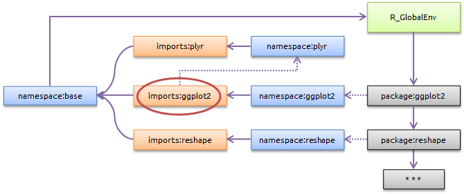

```{r setup, include=FALSE}
knitr::opts_chunk$set(echo = TRUE, tidy=TRUE, tidy.opts=list(blank=FALSE, width.cutoff=50))
options(width=50)
# Install necessary packages only
InstallPackages <- function(Packages) {
  sapply(Packages, function(Package) 
    if (!Package %in% installed.packages()[, 1]) install.packages(Package))
}
InstallPackages(c("devtools", "roxygen2"))
```

# Cadre

## Outil diffusable

Trois fois le même code : écrire une fonction.

Trois utilisations de la même fonction : écrire un package.


## Formalisme

Standardisation du code.

Vérifications.

Documentation obligatoire.


## Outils

_devtools_ et _roxygen2_ simplifient le travail.


# Création d'un package

## Conception

A quoi va servir le package ?

- Consolidation de sa recherche : le package rassemble et organise des méthodes. Exemples : _entropart_, _ade4_.

- Outil d'intérêt général. Exemples : _EcoFoG_, _vegan_, _spatstat_, _ggplot2_.

Un package ne doit traiter qu'un sujet.
Si nécessaire, écrire plusieurs packages.


## Exemple travaillé

Package _multiple_ :

- des fonctions : `Double(x)`, `Triple(x)` et `Multiple(x, n)`... pour calculer des multiples.

- des fonctions comme `FuzzyDouble(x)` pour calculer des multiples avec un bruit.

- une représentation graphique du multiple en fonction de `x` (une droite).

## Création

Le package est créé dans le dossier indiqué.


```{r, eval=FALSE}
devtools::create(path="multiple")
```
Le dossier final a le nom du package.

Ouvrir le projet du package.

Etudier les fichiers créés.

## DESCRIPTION

```
Package: multiple
Title: Compute multiples
Version: 0.0.0.9000
Authors@R: person("First", "Last", email = 
  "first.last@example.com", role = c("aut", "cre"))
Description: Efficiently calculate multiples of numbers, 
  following Me et al. (2018).
Depends: R (>= 3.4.3)
License: GNU General Public License
Encoding: UTF-8
LazyData: true
```


## Fonctions

Code dans des fichiers .R

Organisation libre, les fichiers ne seront pas dans le package.

Choix :

- un fichier `Project.R` pour le code commun à tout le package

- un fichier R par groupe de fonctions, ici :  `Double.R` et `FuzzyDouble.R`


## Project.R

Code commun

```
#' multiple
#'
#' Exercise package
#'
#' @name multiple
#' @docType package
#' @import ggplot2  # Erreur volontaire
NULL
```

## Compute.R

Première version de `Double(x)`

```{r}
Double <- function(number) {
  return(2*number)
}
```

Exécuter le code pour charger la fonction en mémoire.

Tester.

## Documenter

_Insert Roxygen sleleton_ :

```
#' Double
#' 
#' Compute the Double value of a vector
#' 
#' The Double is calculated by multiplying each value by 2.
#'
#' @param number A numeric vector
#'
#' @return A vector containing the Double values.
#' @export
#'
#' @examples
#' Double(runif(3))
```
`Double()` est exportée.


## Oxygéner et installer

_Build Source package_ : crée multiple_0.0.0.9000.tar.gz avec sa documentation.

Etudier le contenu de `man`

Charger le package :

- Nettoyer l'environnement (fonctions en mémoire)

- _Install and Restart_

```{r, tidy=FALSE, eval=FALSE}
?multiple
```


## Vérifier le package

_Check_

```
(...)
checking package dependencies ... ERROR
Namespace dependency not required: 'ggplot2'

(...)
R CMD check results
1 error  | 0 warnings | 0 notes
```
Corriger _toutes_ les erreurs, avertissements et notes.

## Ecrire un générique

Problème : `Double()` transforme les entiers en réels.

```{r}
str(Double(1L))
```

Solution :
```{r}
str(1L*2L)
```

## Ecrire un générique

```{r}
Double <- function(x, ...) {
  UseMethod("Double")
}

Double.default <- function(x, ...) {
  return(2*x)
}

Double.integer <- function(x, ...) {
  return(2L*x)
}
```

Exécuter et tester.

```{r}
str(Double(2L))
```

Remarquer : le respect de la signature, obligatoire.

## Documenter

Un seul fichier d'aide : `@name` et `@rdname`

```
#' Double
(...)
#' @param x A vector
#' @param ... Unused
(...)
#' @name Double
#NULL

#' @rdname Double
#' export
Double <- function(x, ...) {
  UseMethod("Double")
}

```


## Documenter

Les méthodes S3 doivent être déclarées, pas exportées mais Roxygen exige `@export` pour la déclaration.

```
#' @rdname Double
#' @method Double default
#' @export
Double.default <- function(x) {
  return(2*x)
}

#' @rdname Double
#' @method Double integer
#' @export
Double.integer <- function(x) {
  return(2L*x)
}
```
_Build Source package_, _Install and Restart_ puis `?Double`


## Traiter les erreurs

`Double.default()` peut revevoir un objet non numérique.

```{r}
Double.default <- function(x) {
  # Input check
  if (!is.numeric(x)) stop("Double requires a numeric object")
  
  # Compute and return
  return(2*x)
}
```

Tester après _Install and Restart_ (Oxygénation inutile).

Que se passe-t-il si `x` est une matrice ?
```
#' @param x An object
```

## Double avec bruit

Objectif : écrire une fonction double, avec un terme d'erreur normal, qui retourne un data.frame avec `x` et son double, facile à dessiner.

La fonction va dans un nouveau fichier : `FuzzyDouble.R`

Ecrire la fonction et la tester en la sourçant.


## Fonction 

```{r, eval=FALSE}
FuzzyDouble <- function(x, mean=0, sd=1) {

  # Double x and add normal error
  y <- 2*x+stats::rnorm(n=length(x), mean=mean, sd=sd)
  # Make a data.frame
  fuzzydouble <- data.frame(x=x, y=y)
  # Make it a FuzzyMultiple object
  class(fuzzydouble) <- c("FuzzyDouble", class(fuzzydouble))

  return(fuzzydouble)
}
```

Remarquer :

- `stats::rnorm()` ; Classe ;

- Commentaires


## Fonction 

Ne pas oublier les tests !

```{r, eval=FALSE}
FuzzyDouble <- function(x, mean=0, sd=1) {
  # Input check
  if (!is.numeric(x)) stop("Double requires a numeric object")
  if (!is.numeric(mean)) stop("The mean noise must be numeric")
  if (!is.numeric(sd)) stop("The standard deviation of the noise must be numeric")
  if (length(mean)>1 | length(sd)>1) stop("The mean and standard deviation of the noise must be of length 1")
  if (sd < 0) stop("The standard deviation of the noise must be positive")

 # (...)
}
```

## Documenter

```
#' FuzzyDouble
#'
#' Fuzzy double of a numeric object.
#'
#' Doubles an object with a random noise: a Gaussian error drawn 
#'   by \code{\link{rnorm}}.
#'
#' @param x A numeric object
#' @param mean The mean noise. Default is 0.
#' @param sd The standard deviation of the noise. Default is 1.
#'
#' @return a \code{FuzzyDouble} object which is a data.frame with 
#'   columns \code{x} for the input and \code{y} for the output.
#'
#' @seealso \code{\link{plot.FuzzyDouble}}, 
#'   \code{\link{autoplot.FuzzyDouble}}
#' @export
```

Remarquer : le lien vers `rnorm`, `@seealso`.

## Réoxygéner 

Nettoyer l'environnement

_Build Source package_

_Install and Restart_ 

`?FuzzyDouble`


## Méthodes S3

Ecrire un méthode `plot` pour `FuzzyDouble`

```{r}
plot.FuzzyDouble <- function(x, xlab="x", ylab="Double", ..., LineCol="red") {
  # xy standard plot
  graphics::plot(x$x, x$y, xlab=xlab, ylab=ylab, ...)
  # Add the regression line
  graphics::lines(x$x, 2*x$x, col=LineCol)
}
```

Remarquer :

- Les `...` et le passage de `xlab` et `ylab`


## Méthodes S3

Ecrire un méthode `autoplot` pour `FuzzyDouble`

```{r}
autoplot.FuzzyDouble <- function(object, xlab="x", ylab="Double", ..., LineCol="red") {
  # ggplot
  thePlot <- ggplot2::ggplot(data = x, ggplot2::aes_(x=~x, y=~y)) + 
    ggplot2::geom_point() +
    ggplot2::labs(x=xlab, y=ylab) + 
    ggplot2::geom_line(ggplot2::aes_(y=~2*x), colour=LineCol)
  return(thePlot)
}

```

## Documenter

```
#' Plot FuzzyDouble
#'
#' Plot a FuzzyDouble object
#'
#' @param x The \code{\link{FuzzyDouble}} object
#' @param xlab The X-axis label
#' @param ylab The Y-axis label
#' @param ... Extra parameters passed to \code{\link{plot}}
#' @param LineCol The color of the line representing $y=2x$
#'
#' @importFrom graphics plot
#' @method plot FuzzyDouble
#' @export
#'
#' @examples
#' plot(FuzzyDouble(1:10))
```
Remarquer : la formule mathématique, la déclaration de la méthode S3 et l'importation du générique.


## Documenter

```
#' Plot FuzzyDouble
#'
#' Plot a FuzzyDouble object with ggplot2
#'
#' @inheritParams plot.FuzzyDouble
#' @param object The \code{\link{FuzzyDouble}} object
#' @param ... Extra parameters passed to \code{\link{autoplot}}
#'
#' @return A \code{\link{ggplot}} object.
#'
#' @importFrom ggplot2 autoplot
#' @method autoplot FuzzyDouble
#' @export
#'
#' @examples
#' autoplot(FuzzyDouble(1:10))
```

Remarquer : l'héritage des paramètres, sauf `object`. et `...`

## Vérifier

_Check_  détecte que les packages _stats_, _graphics_ et _ggplpot2_ manquent dans `DESCRIPTION`.

Corriger :
```
Depends: R (>= 3.4.3), graphics, ggplot2
Imports: stats
```

## Règles de dépendance

```{r R-library, echo=FALSE, out.width='80%'}

```

Dans `DESCRIPTION`:

- Imports: _stats_ comme _plyr_. Standard.

- Depends: _graphics_ comme _reshape_ à cause des génériques.


## Règles de dépendance

Toute fonction d'un package doit être appelée explicitement: `graphics::plot()`

- Ne pas importer ces fonctions dans l'espace de nom (`@importFrom`).

- Leurs packages doivent être déclarés _Imports_ dans `DESCRIPTION`.


## Règles de dépendance

Les fonctions publiques du package doivent être exportées (`@export`), y compris les génériques.

Les méthodes S3 ne sont pas exportées mais obligatoirement déclarées (`@method`). 

Attention : Roxygen2 ne les déclare que si `@export` est ajouté.

Conséquence : les génériques doivent être importés (`@importFrom`) et leur package déclaré _Depends_ dans `DESCRIPTION` pour être exportés.

Etudier `NAMESPACE`


## Reste à écrire

La fonction `Multiple(x, n)` avec un paramètre supplémentaire.

`Double(x)` pourrait appeler `Multiple(x, 2)` et lui sous-traiter les vérifications et les calculs.

Une classe `Multiple` dont `n` pourrait être un attribut, ses méthodes `plot` et `autoplot`...


## Données

Des données peuvent être intégrées au package dans un ou des fichiers RData.

Créer un dossier `/data`

La fonction `use_data()` crée les fichiers:

```{r, eval=FALSE}
MyData <- 1:100
devtools::use_data(MyData)
```


## Documentation des données

Dans `Project.R`:

```
#' My Data
#'
#' A useless dataset.
#'
#' @format A numeric vector
#' @source \url{http://www.ecofog.gf/}
"MyData"
```


# Contrôle de source

## Objectif

Suivre le développement du package.

Collaborer.

Le rendre accessible sur GitHub.

Bénéficier des outils de GitHub : intégration continue, couverture du code.


## Passer le projet sous contrôle de source

A partir d'un projet RStudio existant :

- Passer le projet sous contrôle de version : 

    - _Tools /Version Control /Project Setup..._
    
    - Sélectionner _Git_.

- Créer un dépôt sur GitHub, récupérer son URL : https://github.com/MonCompte/MonDepot.git

- Dans le Terminal de RStudio, exécuter :

```
git remote add origin https://github.com/MonCompte/MonDepot.git
git push -u origin master
```

## Séance de travail

- Tirer ;

- Modifier ;

- **Vérifier : _Check_ pour valider le package.**

- Livrer ;

- Pousser.


## Numéros de version

Standard R :

Majeure.Mineure-Patch.Développement

Dans `DESCRIPTION` :
```
0.0.0.9000
```
- Rétablir le tiret. 

Version de développement à partir de 9000, seulement entre deux versions CRAN: 
```
0.1-0
```


## NEWS.md

Fichier Markdown pour lister les avancées du projet.

Exemple :
```
# EcoFoG 1.2-1

## Correction de bug

* Modèle Présentation : tricotage Beamer impossible en absence 
  de bout de code. Ajout de `\usepackage{fancyvrb}` dans 
  `EcoFoGBeamer.tex`.

## Améliorations

* _.gitignore_ dans tous les modèles.

```
## Séance de travail

- Tirer ;

- Modifier ;

- Vérifier : _Check_ pour valider le package.

- **Mettre à jour la version dans `DESCRIPTION` et compléter `NEWS.md`**

- Livrer ;

- Pousser.


## Intégration continue

_Travis-CI_ vérifier le package par un _Check_ à chaque livraison.

- Ouvrir un compte sur Travis

- Ajouter le dépôt GitHub du package.

_codecov.io_ mesure la proportion du code exécutée par Travis

- Ouvrir un compte sur _codecov.io_

- Ajouter le dépôt GitHub du package.


## travis.yml

Fichier de paramétrage:

```
language: R
sudo: false
cache: packages

r_packages:
 - devtools
 - covr

after_success:
  - Rscript -e 'library(covr); codecov(type ="all")'

```

## Badges

Dans `README.md` (package _EricMarcon/SpatDiv_):

```


]
 (https://travis-ci.org/EricMarcon/SpatDiv)

]
  (https://codecov.io/github/EricMarcon/SpatDiv)
```

D'autres badges sur _shields.io_.


# Vignette

## Intérêt

Les vignettes sont la documentation d'un package.

Nombreux formats possibles :

- [entropart](https://EricMarcon.github.io/entropart/) : format packagedocs, totalement déporté.

- [EcoFoG](https://ecofog.github.io/EcoFoG/Introduction.html) : format BioConductor, interdit sur CRAN.

- Vignettes _knitr_ en PDF...

```{r, eval=FALSE}
# Liste des vignettes
vignette(package="ggplot2")
# Ouvrir une vignette
vignette("ggplot2-specs", package="ggplot2")
```


## packagedocs

Installer le package. 

Le déclarer dans `DESCRIPTION` :

```
Suggests: packagedocs
```

[Mode d'emploi](http://hafen.github.io/packagedocs/)

La documentation doit être écrite dans `vignettes/docs.Rmd`

Une vignette automatique contient l'aide des fonctions.


## packagedocs

Initialisation :

```{r, eval=FALSE}
packagedocs::init_vignettes()
```

Compléter les entêtes de `docs/vignettes/docs.Rmd` et `rd.Rmd` et corriger :

```
navpills: |
  <li class="active"><a href='index.html'>Docs</a></li>
  <li><a href='rd.html'>Package Ref</a></li>
  <li><a href='https://github.com/Utilisateur/Depot'>Github<i class='fa fa-github'></i></a></li>
```


## Construction des vignettes

Exécuter :
```{r, eval=FALSE}
packagedocs::build_vignettes(output_dir = "docs")
```

pour créer les vignettes


## Vignettes en ligne

Pousser sur GitHub.

Activer les pages web sur `/docs`.

L'appel aux vignettes dans R renvoie sur le site.


# Code C++ et parallélisation

## Intérêt

Le code C++ est très rapide mais plus compliqué à écrire et déboguer.

A utiliser seulement en cas de besoin.
Exemple : _dbmss_

La parallélisation permet d'éxécuter des tâches longues sur plusieurs processeurs ou ordinateurs.

Le code est plus complexe.

La synchronisation des tâches consomme des ressources.

A utiliser seulement en cas de besoin.


## Code C++

Démarrage :

```{r, eval=FALSE}
devtools::use_rcpp()
```

Dans `Project.R`:

```
#' @useDynLib multiple, .registration = TRUE
#' @importFrom Rcpp sourceCpp
```


## Code C++

Le code est dans `/src`. Créer un fichier C++ :

```
#include <Rcpp.h>
using namespace Rcpp;

//' timesTwo
//'
//' Multiplies by 2
//'
//' @param x An integer
//' @export
// [[Rcpp::export]]
int timesTwo(int x) {
   return x * 2;
}
```

Remarquer : la documentation pour _Roxygen_, dont `@export` et la directive d'export pour _Rcpp_, sans apostrophe après les `//`


## Fonctionnement de Rcpp

Le package _Rcpp_ compile le code C++, en fait un programme exécutable (librairie _dll_).

Il crée une fonction R du même nom que la fonction C (étudier `R/RcppExports.R`).

La librairie _dll_ est déclarée dans `NAMESPACE` et la fonction R est exportée.


## Paralléliser R

Nombreuses techniques disponibles.

Une très simple pour le code R dans le package _parallel_

`parallel::mclapply` remplace `lapply()`

Sans effet sous Windows.

- Test sur RStudio.


## Paralléliser C

Package _Rcppparallel_

Fonctionnement similaire à _Rcppp_ mais code beaucoup plus complexe.

- [Exemple](https://github.com/EricMarcon/SpatDiv/blob/master/src/CountNbd.cpp) dans _SpatDiv_

Extrêmement efficace, y compris sous Windows.

Problèmes avec [CRAN](https://cran.r-project.org/web/checks/check_results_RcppParallel.html).


# Tests unitaires

## Intérêt

Tester le code pour vérifier :

- sa syntaxe (le code non exécuté n'est pas vérifié par _Check_) ;

- ses résultats.

Principes :

- exécuter tout le code (couverture = 100\%) ;

- comparer les résultats entre eux ou à des références.

## Outil

Package _testthat_

```{r, eval=FALSE}
devtools::use_testthat()
```

Crée les dossiers et modifie `DESCRIPTION`. 
```
Suggests: testthat
```

Ajouter les fichiers de tests dans `tests/testthat`


## Exemple de test

`Double.R` :

```{r}
testthat::context("Double")

# Random integer vector
x <- rpois(10, lambda = 100)

testthat::test_that("Default and integer S3 methods give the same result", {
  testthat::skip_on_cran()
  testthat::expect_equal(Double(x), Double(as.numeric(x)))
})


testthat::test_that("Double(integer) is integer", {
  testthat::skip_on_cran()
  testthat::expect_is(Double(x), "integer")
})
```

## Ajout de tests

Tester tout le code :

- les tests négatifs :

- les cas rares.

Utiliser codecov.io pour voir le code non couvert.

- [Exemple](https://codecov.io/github/EricMarcon/entropart) de _entropart_


# CRAN

## Intérêt

Un package sur CRAN peut être utilisé par tous.

Il peut être publié : _Methods in Ecology and Evolution_, ... , _The R Journal_.

L'auteur aura des retours d'autres utilisateurs.


## Contraintes

Le responsable du package (`role = c("aut", "cre")`) doit répondre aux sollicitations de CRAN.

Le package ne doit générer aucun avertissement, et normalement aucune note.

La vérification sur CRAN est plus exigente :

- plusieurs plateformes ;

- des tests du code C.


## Préparation 

Vérification OK localement et sur Travis.

Construire la source du package avec la dernière version de R. 

Vérifier le package sur : 

- [Win-Builder](The r-hub builder) : plateforme Windows ;

- [The r-hub builder](https://builder.r-hub.io/) : nombreuses plateformes.


## Soumission 

Vérifier que la version est à correcte :

- patch = 0 sauf si c'est un patch.

- pas de version de développement.

Soumission sur [CRAN](https://xmpalantir.wu.ac.at/cransubmit/).

En cas de rejet, corriger et resoumettre en incrémentant le patch.


## Publication  

En cas de publication, ajouter un fichier `inst/CITATION`


[Exemple](https://github.com/EricMarcon/entropart/blob/master/inst/CITATION) de `entropart`

```{r}
citation(package = "entropart")
```

