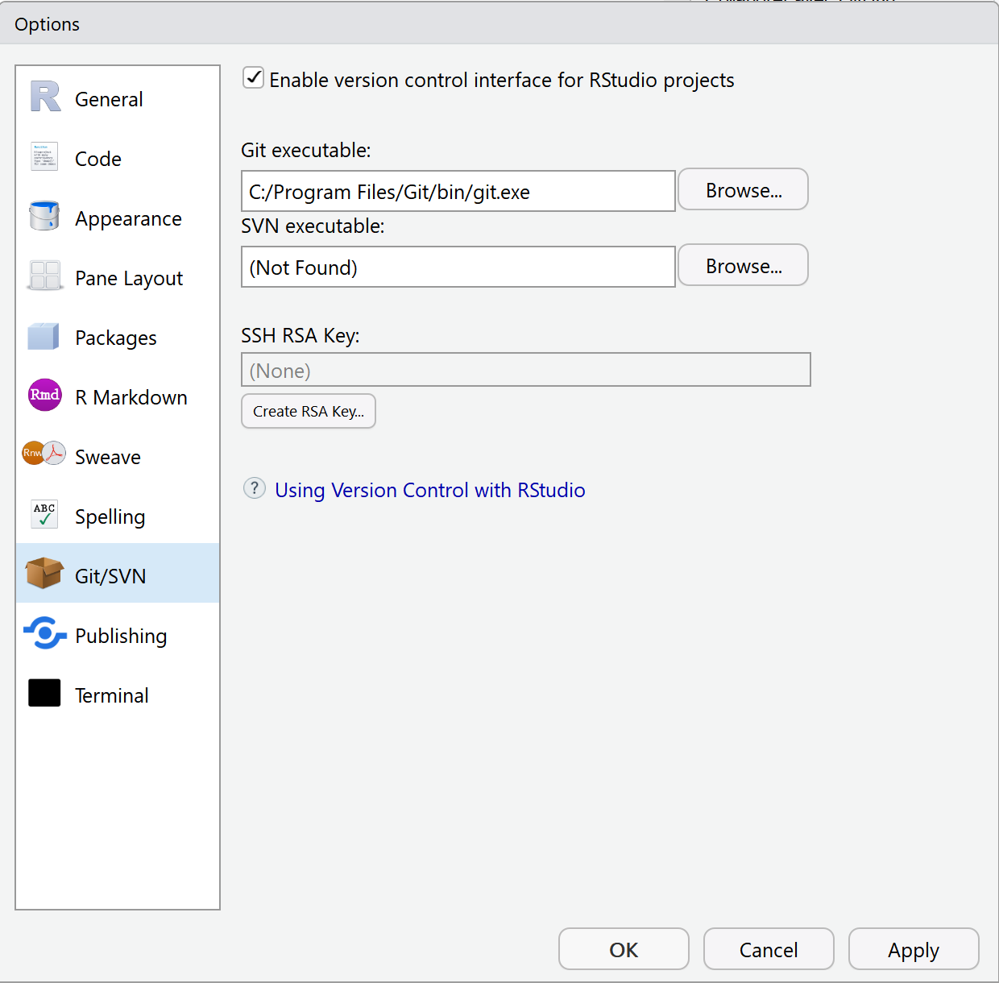
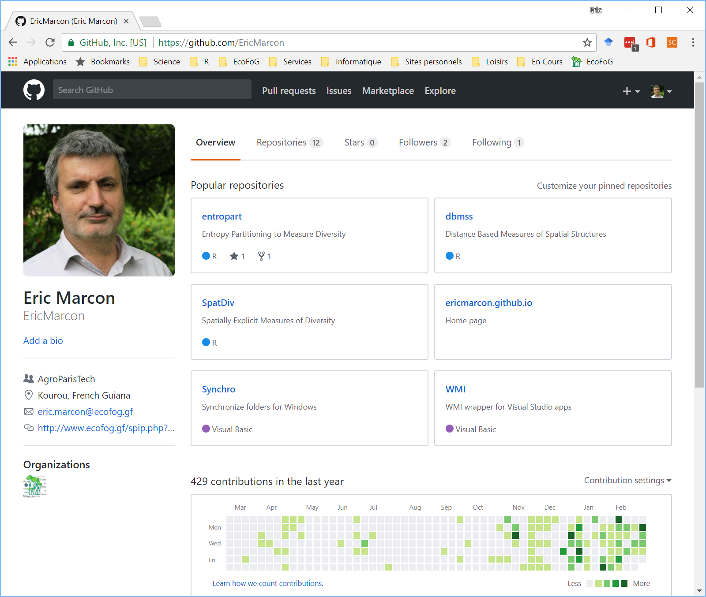
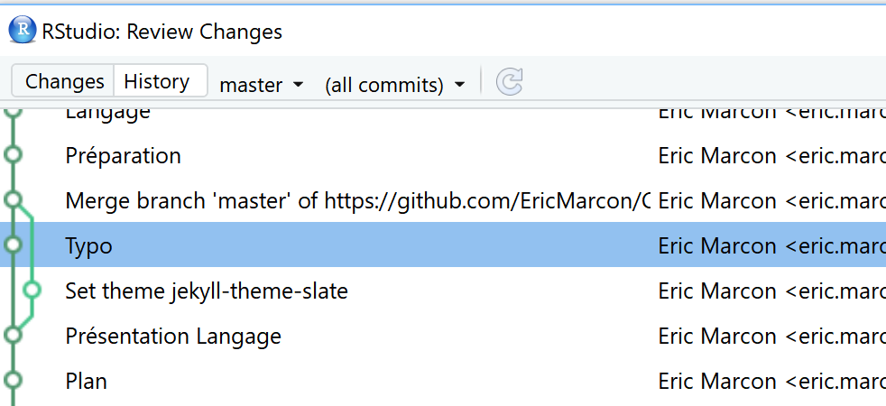

```{r setup, include=FALSE}
knitr::opts_chunk$set(echo = TRUE, tidy=TRUE, tidy.opts=list(blank=FALSE, width.cutoff=50))
options(width=50)
# Install necessary packages only
InstallPackages <- function(Packages) {
  sapply(Packages, function(Package) 
    if (!Package %in% installed.packages()[, 1]) install.packages(Package))
}
InstallPackages(c("devEMF"))
```

# Figures pour la publication

## Principes

Continuité entre l'analyse de données et la production de figures.

Eviter les copier-coller : créer directement des fichiers pour contrôler les tailles relatives.

Si les données changent, les figures sont refaites par le script.

## Exemple

```{r}
plot(cars)
```

## Méthodes

Demander à R d'écrire dans un fichier plutôt qu'à l'écran

```{r}
postscript("Fig1.eps", width = 6, height = 4, horizontal=FALSE)
plot(cars)
dev.off()
```

`postscript` crée un fichier EPS, `pdf` un fichier PDF et `svg` un fichier SVG. 

`bmp`, `jpeg`, `png`, `tiff` créent des fichiers raster.


## Usage

Fichiers vectoriel pour les figures : PostScript ou PDF pour LaTeX, MetaFile pour Word:

```{r}
library("devEMF")
emf("Fig1.emf", width = 6, height = 4)
plot(cars)
dev.off()
```

Fichiers raster pour les rasters ou demandes particulières.


## Points de vigilance

Taille des caractères.

Couleurs ou non.

Ne passer en raster qu'en tout dernier recours. 300 dpi minimum.

Utiliser la documentation des fonctions pour les finitions (polices, taille, transparence...).


## Exemple de PLOS

[Instructions](http://journals.plos.org/plosone/s/figures)

Les seuls formats acceptés sont PostScript et TIFF.

Les tailles sont précisées.

R n'encapsule pas les polices dans les fichiers EPS. 
Utiliser _Inkscape_ pour transformer les polices en courbes avant publication.


# Collaborer avec GitHub

## Principes

Git est un gestionaire de sources :

- Suivi des modifications : bien plus qu'une sauvegarde !

- Possibilité de développer à plusieurs : plus de pièces jointes !

- Possibilité de revenir en arrière ;

- Possibilité de fourcher.

GitHub est une plateforme pour la collaboration basée sur Git.


## Mise en place

RStudio doit détecter Git

```{r, echo=FALSE, out.width='60%'}

```

Sinon, l'installer.


## Mise en place

Ouvrir un compte sur GitHub

```{r, echo=FALSE, out.width='60%'}

```


## Créer un projet

A partir de rien GitHub :

- Dans GitHub : 

    - _New Repository_
  
    - Choisir le nom (pas de caractères spéciaux)
  
    - Ajouter un _.gitgnore_ approprié.

- Copier l'URL à partir de _Clone or Download_

- Dans RStudio : nouveau projet à partir de Git, coller l'URL.


## Créer un projet

A partir d'un projet RStudio existant :

- Passer le projet sous contrôle de version : 

    - _Tools /Version Control /Project Setup..._
    
    - Sélectionner _Git_.

- Créer un dépôt sur GitHub, récupérer son URL : https://github.com/MonCompte/MonDepot.git

- Dans le Terminal de RStudio, exécuter :

```
git remote add origin https://github.com/MonCompte/MonDepot.git
git push -u origin master
```

## Opérations élémentaires : filtrage

Les fichiers modifiés sont dans la fenêtre Git de RStudio.

Utiliser .gitignore pour masquer les fichiers non suivis.

- Créer un fichier R avec une ligne de code et l'enregistrer.


## Opérations élémentaires : commit

Après chaque séance de travail, livrer le résultat (_Commit_)

Sélectionner les fichiers à livrer.

Saisir un message clair : résumé sur la première ligne.


## Opérations élémentaires : synchroniser

Pousser (_Push_) ses modifications vers GitHub pour les rendre publiques.

Tirer (_Pull_) pour résupérer les modifications sur GitHub.


## Opérations élémentaires : collaborer

Déclarer un collaborateur.

Travailler à deux ou plus sur le même fichier.

Contenu d'une séance de travail :

- Tirer ;

- Modifier ;

- Livrer ;

- Pousser.


## Conflits

L'information élémentaire est la ligne.

Modifications contradictoires =  conflit.

Minimiser les conflits : dans un texte, une phrase = une ligne.

En cas de conflit, trancher.

- Générer un conflit et le régler.


## Suivi du projet

Icône en forme d'horloge dans la fenêtre Git

```{r, echo=FALSE, out.width='80%'}

```


## Désastre

```{r, echo=FALSE, out.width='35%'}
knitr::include_graphics("Graphics/git_2x.png")
```
^https://xkcd.com/1597/^

[Reset](https://git-scm.com/book/en/v2/Git-Tools-Reset-Demystified) permet de revenir à une version précédente.


## Opérations avancée : fork

[Fourcher](https://help.github.com/articles/fork-a-repo/) : commencer une nouvelle branche.

Automatique en cas de modification d'un projet tiers.

Une branche sera abandonnée ou fusionnée (_Merge_).

Une demande de fusion s'appelle _Pull Request_.


# Ecrire avec RMarkdown

## Principes

Markdown est un format d'écriture très simple et lisible.

[Pandoc](https://pandoc.org/) convertit les documents Markdown en LaTeX (à compiler en PDF), HTML, Word...

[RMarkdown](https://rmarkdown.rstudio.com/) étend Markdown pour R et [Bookdown](https://bookdown.org/yihui/bookdown/) étend RMarkdown.

[knitR](https://yihui.name/knitr/) exécute le code R à l'intérieur des documents et appelle RMarkdown.


## Document RMarkdown simple

Dans RStudio : _File_ / _New File_ / _R Markdown_...

```{r, echo=FALSE}
knitr::include_graphics("Graphics/NouveauRMarkDown0.PNG")
```


## Syntaxe

Etudier le modèle :

- En-tête YAML et premier bout de code ;

- Formatage du texte ;

- Bouts de code.

[Anti-sèche](https://rmarkdown.rstudio.com/articles.html).


## Tricotage

- Tester les 3 formats : HTML, PDF, Word.

PDF nécessite LaTeX.

Le même document peut être utilisé sous différents format sans réécriture.


## Modèles

Des packages fournissent des modèles.

```{r, echo=FALSE}
knitr::include_graphics("Graphics/NouveauRMarkDown.PNG")
```


## Modèles EcoFoG

Présentation : Beamer et HTML (utiliser _ioslides_).

Article : PDF pour l'autoarchivage et HTML pour la lecture. Word possible.

Ouvrage (Mémoire de master, Thèse, HDR, livre) : PDF et HTML.

[Démonstration](https://ecofog.github.io/EcoFoG/)

Documentation dans les modèles.

- Ouvrir les modèles.


## Méthode de travail

Un projet R contient tout :

- Modèle de document ; Fichiers nécessaire à la mise en forme (styles de texte, de bibliographie, ...) ;

- Données ; Code R pour produire les résultats, y compris les figures ;

- Figures additionnelles.


Ce n'est pas un package :

- Un package a une organisation formelle inutile pour un article.


## Création du projet

Utiliser l'assistant _Nouveau Fichier /R Markdown... /A partir d'un modèle / Article EcoFoG_.

Un nouveau dossier est créé. Le transformer en projet R: _Nouveau projet /A partir d'un dossier existant_.

Tricoter pour vérifier le fonctionnement.

Possibilité de tricoter en HTML pour gagner du temps.


## Données

Placer les données dans le projet, dans un format lisible par R (typiquement, CSV).

Lire les données dans le préambule de l'article.


## Calculs et figures

Placer les calculs dans des bouts de code dans la section Matériels et Méthodes.

Utiliser les options des bouts de code :

- `echo` : affichage du code dans l'article (FALSE pour la publication) ;

- `cache` : pour ne pas répéter les calculs à chaque compilation.

Les figures sont produites directement par le code :

- insérer les bouts de code contenant les commandes `plot` dans la section _Résultats_.


## Bibliographie

Utiliser sa bibliographie générale, produite par Mendeley :

- Pas de perte de temps pendant la rédaction ;

- Produire une bibliographie autonome à la fin avec Jabref (_Tools /New Sublibrary based on AUX file_).


Ou utiliser directement une bibliographie spécifique, dans un fichier bib autonome.

Voir la [Documentation](http://rmarkdown.rstudio.com/authoring_bibliographies_and_citations.html).


## Séparer l'atelier et le magasin

Modèles EcoFoG sauf _ouvrage_ : script _GitHubPages.R_

Les fichiers produits (PDF, HTML, libs) sont déplacés dans /_docs._

Le fichier /README.md est dupliqué dans /_docs_.

- Tricoter aux formats PDF et HTML.

- Exécuter _GitHubPages.R_.

Modèles EcoFoG _ouvrage_ : _Build Book_ tricote tout dans /_docs_.


## Collaboration

Passer le projet sous Git et le pousser sur GitHub.

Ajouter des collaborateurs.


## Présentation

Activer les pages web du dépôt GitHub :

- Settings, GitHub Pages :

    - Source = Master Branch / docs Folder
    
    - choisir un thème.

## Présentation

Dans README.md, ajouter les liens vers les fichiers produits :

- HTML pour la lecture en ligne ;

- PDF pour le téléchargement.